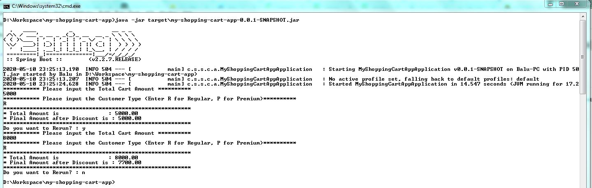

# my-shopping-cart-app
 Standalone application showcasing the discount calculation in a E-Commerce shopping cart application.

 ## How to start ?
 * Go to project directory and run the below command, which starts the application.
 ```
 mvn spring-boot:run
 ```
You will see the program running with a command line runner, which expects you to enter information to calculate the discounted amount.


* I have included 4 test cases as part of this. You can execute them with below command.
 ```
 mvn test
 ```
